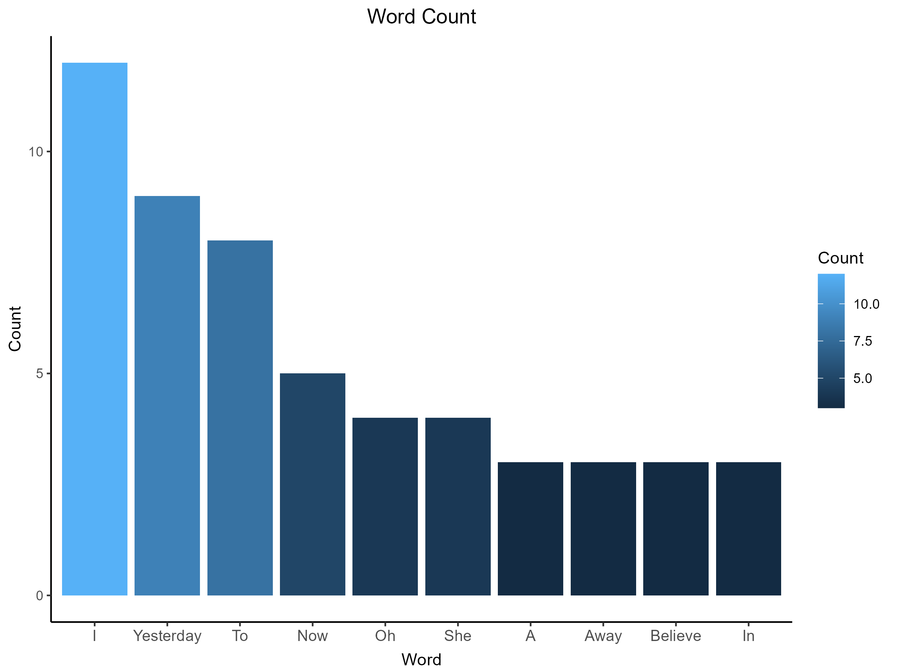
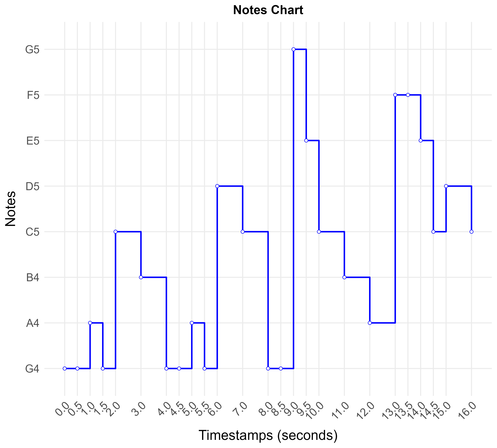

# musicvisu R package

## Indexes
- [Overview](#overview)
- [Installation](#installation)
- [Features](#features)
- [Usage](#usage)
  - [frequencies_to_notes()](#frequencies_to_notes)
  - [lyrics_chart()](#lyrics_chart)
  - [notes_chart()](#notes_chart)
  - [frequency_spectrum()](#frequency_spectrum)
  - [waveform_chart()](#waveform_chart)
  - [note_duration_chart()](#note_duration_chart)
- [License](#license)
- [Contributing](#contributing)
- [Contact](#contact)

## Overview

musicvisu is an R package that helps visualize musical notations and lyrics. It provides functions to transform frequency data to musical notations, create charts of the most frequent words in song lyrics, visualize note progressions over time, analyze audio frequency spectra, plot waveforms, and compare note durations.

## Installation

First, install the devtools package from CRAN:
```r
install.packages("devtools")
```

Then install the development version from GitHub:
```r
devtools::install_github("aidinghazagh/musicvisu")
```

Load the package:
```r
library(musicvisu)
```

## Features

- Transform frequency data to musical note names
- Analyze word frequency patterns in song lyrics
- Visualize musical note progressions over time
- Compute and plot frequency spectra from audio samples (FFT)
- Display audio waveforms
- Compare average note durations

## Usage

### frequencies_to_notes()
```r
frequencies <- c(440, 880, 261.63)
notes <- frequencies_to_notes(frequencies)
cat(notes)
# Output: A4 A5 C4
```

### lyrics_chart()
```r
file <- "path/to/lyrics.txt"
output <- "path/to/output/"
lyrics_chart(file, output, filterCount = 3)
```



### notes_chart()
```r
notes <- c(
  "G4", "G4", "A4", "G4", "C5", "B4",
  "G4", "G4", "A4", "G4", "D5", "C5",
  "G4", "G4", "G5", "E5", "C5", "B4", "A4",
  "F5", "F5", "E5", "C5", "D5", "C5"
)

timestamps <- c(
  0.0, 0.5, 1.0, 1.5, 2.0, 3.0,
  4.0, 4.5, 5.0, 5.5, 6.0, 7.0,
  8.0, 8.5, 9.0, 9.5, 10.0, 11.0, 12.0,
  13.0, 13.5, 14.0, 14.5, 15.0, 16.0
)
output_dir <- "path/to/output/"
notes_chart(notes, timestamps, output_dir)
```


### frequency_spectrum()
```r
# Generate a 440 Hz sine wave and plot its frequency spectrum
sample_rate <- 44100
t <- seq(0, 1, length.out = sample_rate)
samples <- sin(2 * pi * 440 * t)
frequency_spectrum(samples, sample_rate, "path/to/output/")
```

### waveform_chart()
```r
# Plot the waveform of audio samples
sample_rate <- 44100
t <- seq(0, 0.05, length.out = 2205)
samples <- sin(2 * pi * 440 * t)
waveform_chart(samples, sample_rate, "path/to/output/")
```

### note_duration_chart()
```r
# Compare how long each note is held on average
notes <- c("C4", "D4", "E4", "C4")
timestamps <- c(0.0, 1.0, 2.0, 3.5)
note_duration_chart(notes, timestamps, "path/to/output/")
```

## License
This package is licensed under the MIT License. See the [LICENSE](LICENSE) file for details.

## Contributing
Contributions are welcome! If you have any ideas or suggestions, feel free to open an issue or create a pull request.

## Contact
If you have any questions or feedback, feel free to reach out:

Email: [ghazaghaidin@gmail.com](mailto:ghazaghaidin@gmail.com)

Linkedin: [Aidin Ghazagh](https://linkedin.com/in/aidin-ghazagh)
